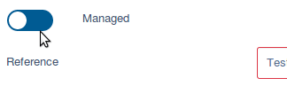

# SilverStripe Admin Toggle Checkbox Fields

Simple module that re-styles all checkboxes in the admin as Toggle fields
(thanks to https://www.w3schools.com/howto/howto_css_switch.asp for the base CSS to make this work)

## Install

Install using composer: `composer require i-lateral/silverstripe-admin-toggle-checkbox`

## Usage

Just install the module and flush the cache. All Checkbox fields in the CMS will be automatically re-styled